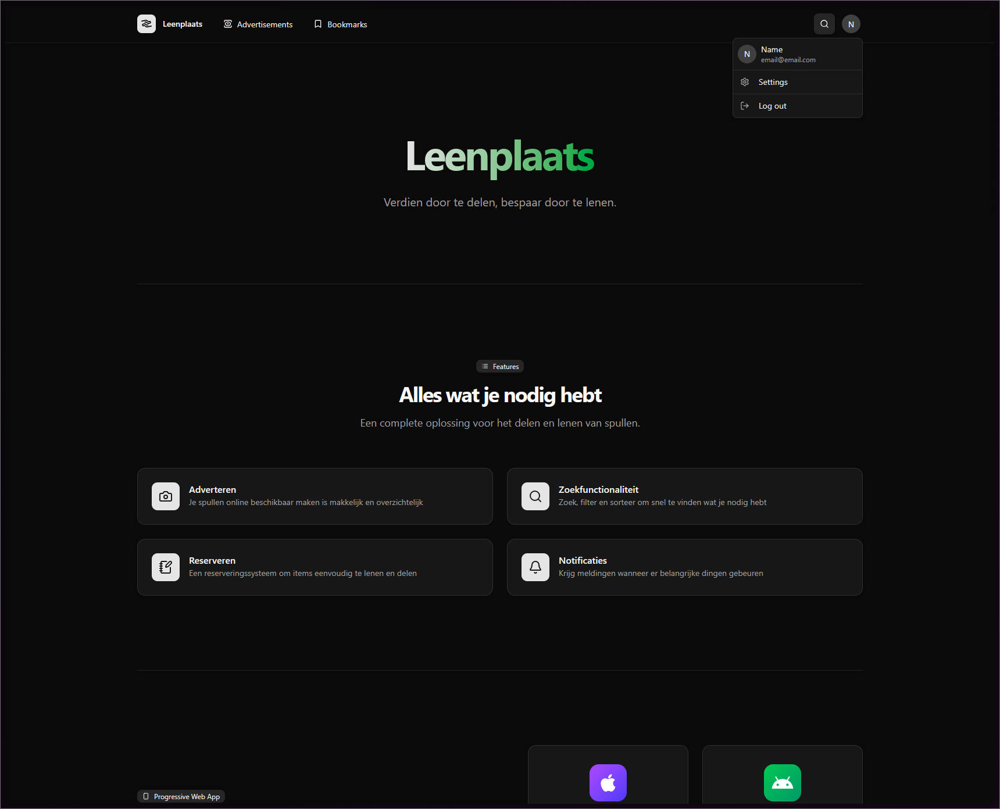
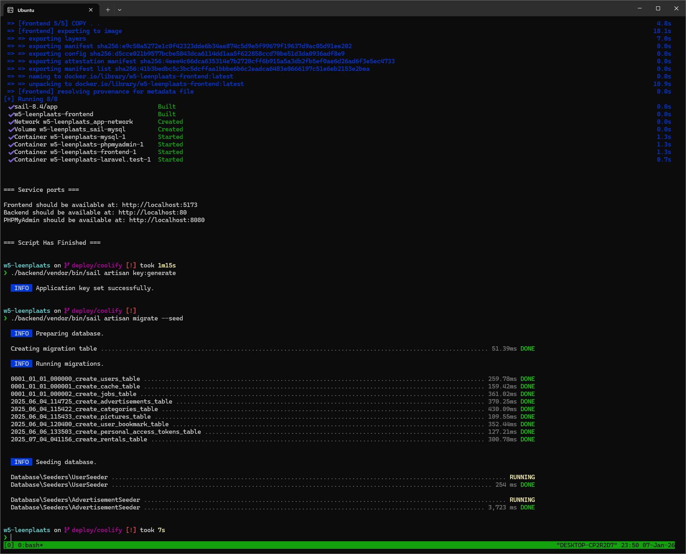

# w5-leenplaats

A Docker-based development environment for the w5-leenplaats project.

## Quick Start

### Prerequisites

Before you begin, ensure you have the following installed on your system

- [Docker](https://docs.docker.com/get-docker/)
- [Docker Compose](https://docs.docker.com/compose/install/)

### Setup and Launch

1. **Clone the repository** (if you haven't already)

   ```bash
   git clone <repository-url>
   cd w5-leenplaats
   ```

2. **Start the development environment**

   ```bash
   ./setup-and-start.sh
   ```

3. **Run some Sail commands**

   1. ```bash
      ./backend/vendor/bin/sail artisan key:generate
      ```
   2. ```
      ./backend/vendor/bin/sail artisan migrate --seed
      ```

4. **Start working!**

### Managing the Environment

**Stop the development environment**

```bash
./stop-and-cleanup.sh
```

## Troubleshooting

### Script Issues

If you cant run the scripts, make them executable

```bash
chmod +x setup-and-start.sh stop-and-cleanup.sh
```

## Development Notes

- Always work from the project root directory
- The backend uses Laravel Sail, so all standard Sail commands are available
- The Project was setup using WSL2 + Docker on Windows, but should work on other platforms because of Docker

## Screenshots



